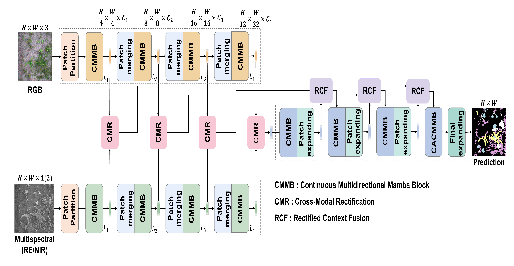

# CMSMamba: An Efficient Multimodal Mamba Network for Crop-Weed Segmentation in UAV Multispectral Imagery 
This repository is about our implementation of CMSMamba for Crop-Weed Segmentation

    

## Requirements
Test with Python 3.10 on Windows, CUDA 11.8

### Core Dependancies
| Package | Version |
|---|---|
| torch | 2.1.1+cu118 |
| torchvision | 0.16.1+cu118 |
| torchaudio | 2.1.1+cu118 |
| mamba-ssm | 1.1.3 |
| causal-conv1d | 1.1.1 |
| timm | 0.4.12 |
| einops | 0.8.1 |

If you encounter any issues installing Mamba, please refer to [VMamba](https://github.com/mzeromiko/vmamba) and [Install VMamba on Windows(CSDN)](https://blog.csdn.net/yyywxk/article/details/140422758)(Chinese)

### Dataset
1. Weedsgalore->[Paper](https://ieeexplore.ieee.org/abstract/document/10944142)、[Download](https://github.com/GFZ/weedsgalore)
2. WeedMap->[Paper](https://www.mdpi.com/2072-4292/10/9/1423)、[Download](https://projects.asl.ethz.ch/datasets/weedmap-2018/)
3. Carrots2017->[Paper](https://onlinelibrary.wiley.com/doi/full/10.1002/rob.21869)、[Download](https://lcas.lincoln.ac.uk/wp/research/data-sets-software/crop-vs-weed-discrimination-dataset/)

### Training Environment
The training script used to produce the results in the paper is tightly 
coupled to our internal experiment tracking (WandB) and local dataset 
directory layout, so it is not included as-is in this repository. Instead, 
this section documents the exact training environment used

| Component | Spec |
|---|---|
| GPU | NVIDIA GeForce RTX 3060 (12 GB VRAM) |
| CPU | AMD Ryzen 7 5800X |
| RAM | 32 GB |
| Framework | PyTorch Lightning, 16-bit mixed precision (AMP) |

**Optimization**

| Setting | Value |
|---|---|
| Optimizer | AdamW (weight decay 0.01) |
| Peak learning rate | 1×10⁻³ |
| LR schedule | Linear warmup (first 5% of steps) → polynomial decay (power = 0.9) |
| Batch size |  8 |
| Max epochs | 1000 |
| Early stopping | Patience of 50 epochs on validation mIoU |

**Loss Function**

Total loss combines Cross-Entropy, Dice, and the proposed NDVI-Guided Saliency Loss

**Data augmentation**

- Standard: horizontal flip / vertical flip / 90° rotation (equal probability), RandomScale (±50%), crop to fixed resolution
- [Enhanced RICAP](https://www.sciencedirect.com/science/article/pii/S016816992100435X)

## Citations
If you find our code is helpful for your research,please cite:
Chuan-Jie Liao and  Pei-Jun Lee, "CMSMamba: An Efficient Multimodal Mamba Network for Crop-Weed Segmentation in UAV Multispectral Imagery"